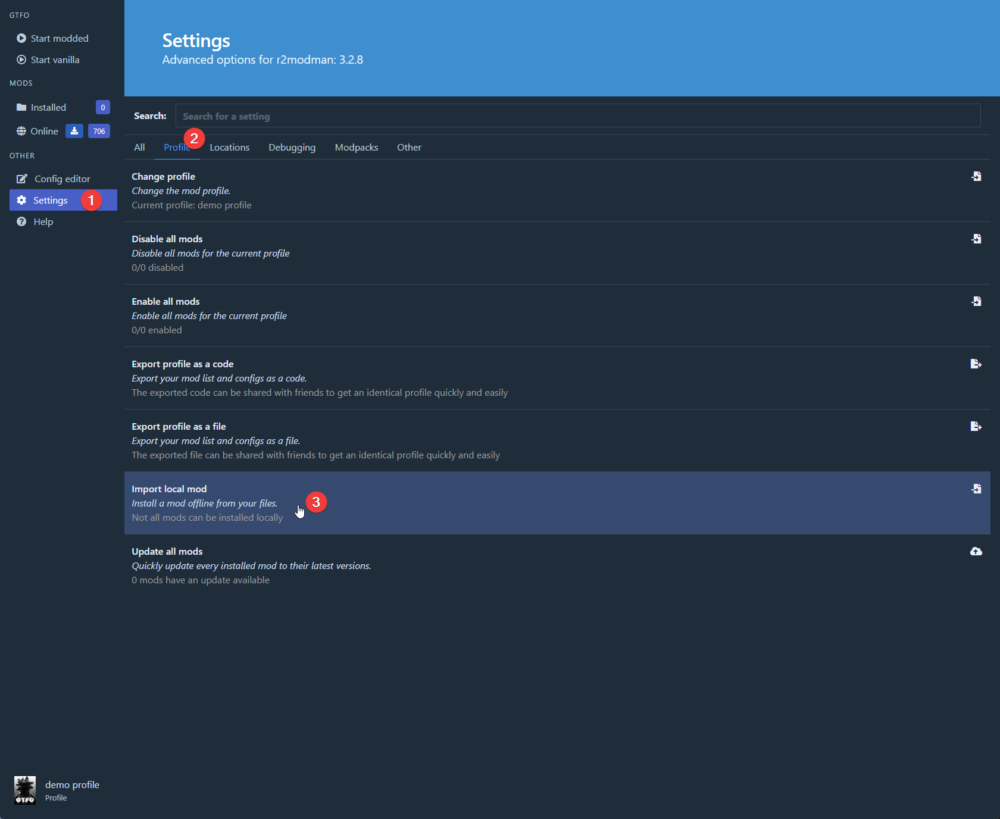

# Speedrunning Core Mod

This mod is mainly for the purpose of allowing mods in GTFO Speedrunning. 
It also features a "Logless" mode for speedrunning which encrypts the player log and 
later allows decryption of those logs by verifiers

## Modes

* Default
* Logless mode

# How to install

1. Download the latest `.zip` [here](https://github.com/GTFO-Speedrunning/SpeedrunningCoreMod/releases/latest)
2. Open Thunderstore/r2mm and in profile of your choosing go to `Settings` -> `Profile` -> `Import local mod`

3. Find and select the downloaded zip and import it.
